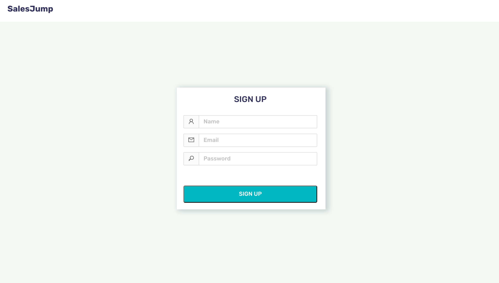

### A guide on how to integrate whatsapp chat to squarespace for live support.

## 1. Sign up for SalesJump from <a href="https://app.salesjump.xyz/register" target="_blank">here</a>

## 2. Click on create widget

## 3. Click on edit widget

## 4. Enter profile and color
Enter all the whatsapp number and make sure its **international code + WhatsApp number**. You can change color of the widget as per your choice. Once done with configuration click on SalesJump logo above in the page to navigate to the dashboard.

## 5. Activate your account
Click on GO LIVE button ➡️ select your plan ➡️ enter card details.  Do not worry about security as payments are processed via stripe and **we do NOT have any access to any of your card details**.

## 6. Copy and paste code into Squarespace
Click on the COPY button on dashboard and then navigate to your squarespace site.
For that open squarespace and navigate to Settings ➡️ Advance ➡️ Code Injection ➡️ Header.  Paste code and click on SAVE button

**Congratulations, your live chat support via whatsapp is ready for squarespace. 🚀**