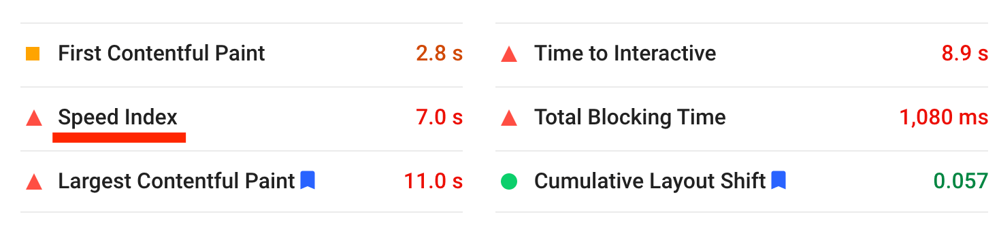
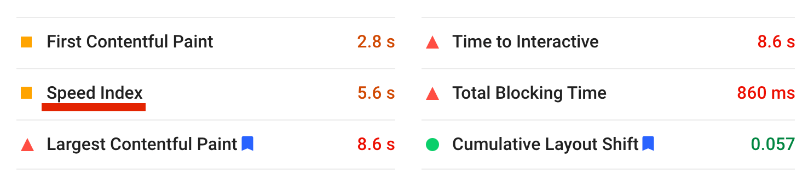
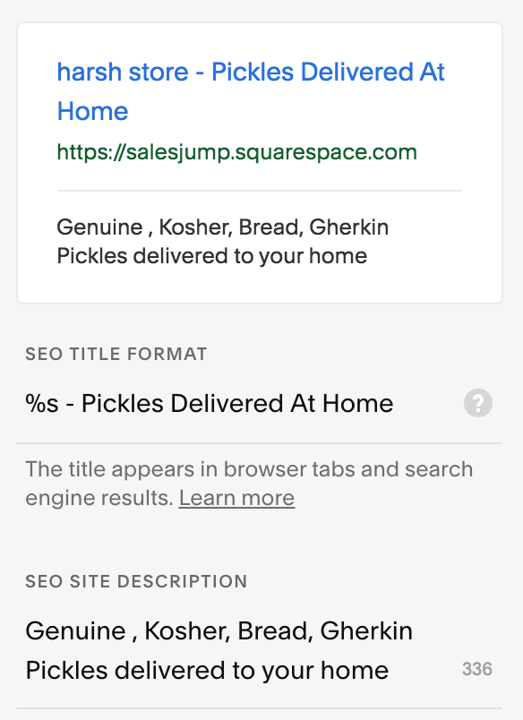
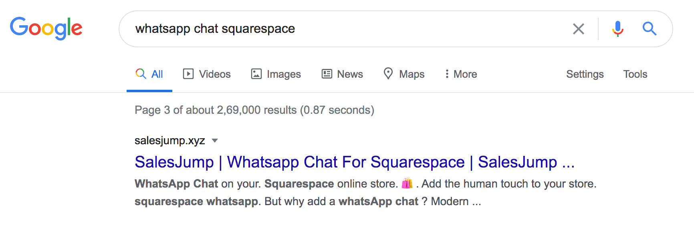
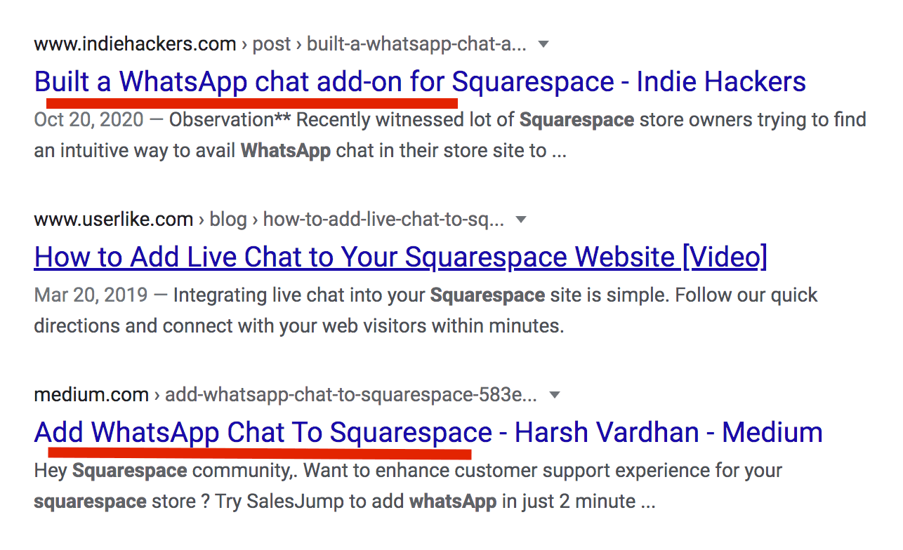
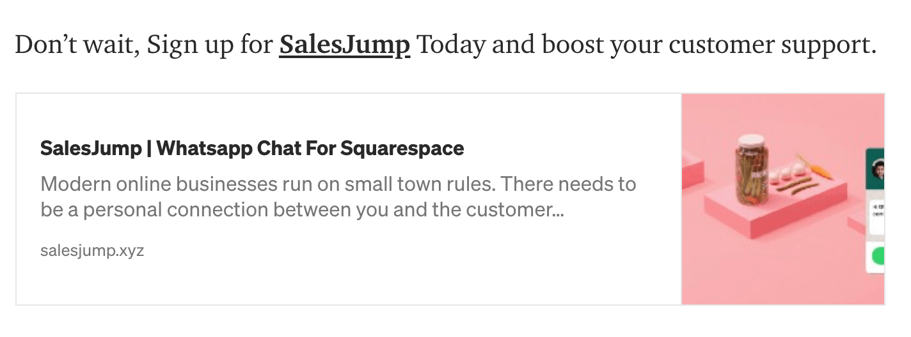
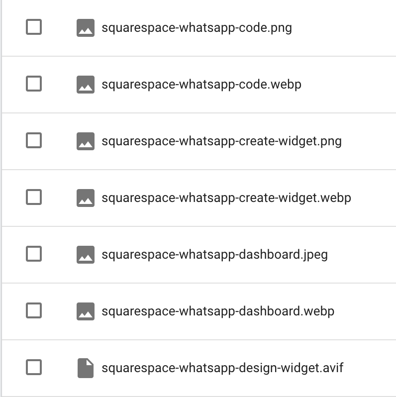
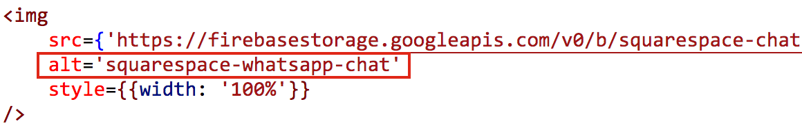
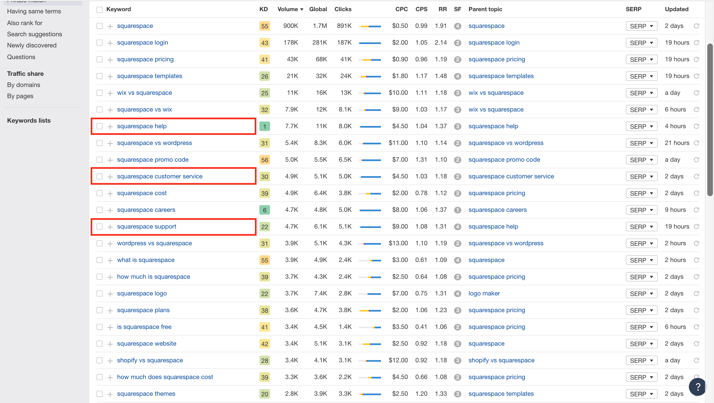

### Welcome to the detailed actionable guide which you can apply today to improve your Squarespace site SEO. We are going to measures the factors by which Google rewards and punishes your site's ranking.

## 1. Reduce size of images
Really? image size. You might be wondering how does that helps in SEO ? well the thing is Google punishes sites with slower performance and they have even rolled out their own <a href="https://developers.google.com/speed/pagespeed/insights" target="_blank"> **tool**</a> which you can use to measure your site's performance.

Below is what the speed index ( time to display all the visible parts) I got with Squarespace sample template - 

Then I optimised the background image of landing page using an <a href="https://tinypng.com/" target="_blank"> **image optimisation tool**</a> which reduced speed index time without much degradation in image quality -

## 2. Write title and description for every page
Give a **clear and focused title and description** for every page since google scans them for results. Make sure the title and descriptions of every page have a **relevance to each other** otherwise it can cause confusion to Google. You need to keep them tailored purely for your own audience.

**Need a proof ?**

I recently built a <a href="https://salesjump.xyz/" target="_blank"> **software product**</a> which is aimed at allowing Squarespace store owners to embed WhatsApp chat on their site so I wrote my
- title as *"SalesJump - WhatsApp Chat For Squarespace"* 
- description as *"WhatsApp Chat For Squarespace | Add WhatsApp To Squarespace"*. 

Within merely a month of launch if you <a href="https://www.google.com/search?q=whatsapp+chat+squarespace" target="_blank"> **search in Google for *"whatsapp chat squarespace"***</a> my product is the  ̶̶̶f̶̶̶i̶̶̶r̶̶̶s̶̶̶t̶̶̶ ̶̶̶r̶̶̶e̶̶̶s̶̶̶u̶̶̶l̶̶̶t̶̶̶ ̶̶̶o̶̶̶n̶̶̶ ̶̶̶t̶̶̶h̶̶̶e̶̶̶ ̶̶̶t̶̶̶h̶̶̶i̶̶̶r̶̶̶d̶̶̶ ̶̶̶p̶̶̶a̶̶̶g̶̶̶e̶̶̶. (**UPDATE:** now on sixth position of the second page 🙂 and always bound to change)

## 3. Content writing with backlinks (preferably on <a href="http://medium.com/" target="_blank"> Medium</a>)
Content writing is widely popular approach for SEO'ing but here's the catch - **It's very hard to make your content visible in the first place** which in return could make your store/site popular as a result. That's where Medium platform can be very essential role since its a platform which comes with very high quality baked in SEO and within your page you can give link to your store. Along with medium you can also write on blogging platforms popular within your business domain (<a href="https://www.indiehackers.com/" target="_blank"> **Indiehackers as in mine**</a>).

**Need a proof ?**

I wrote my blogs on Medium and Indiehackers talking about the <a href="https://salesjump.xyz/" target="_blank"> **software product**</a> I built and now if you <a href="https://www.google.com/search?q=whatsapp+squarespace" target="_blank"> **search in Google for *"whatsapp squarespace"***</a> you might end up seeing two blogs from both the two platforms on which I wrote my content.

Right below the blog you can write backlink to your Squarespace store/site like below

## 4. Write images name and alt tags as relevant keywords
Ensure that all the images have the searched keyword in their image name and alt tags since they are also scanned by Google.

You can see how **squarespace-whatsapp** has been added as common keyword pair throughout for my own site since those are the keywords I optimise by site for.

Do ensure to add your searched keyword in **alt-tag** and **image-file-name**

## 5. Use keyword idea tools
Such tools can give you a quick access to some easy to rank keywords. I personally recommend <a href="https://ahrefs.com/keywords-explorer" target="_blank"> **ahrefs keywords explorer**</a>. It can be a bit expensive, even the cheapest tier is $99/month. But you can simply use their <a href="https://ahrefs.com/start-trial" target="_blank"> **$7 trial for 7 days**</a>  and take a screenshot of the potential keywords like myself for future use 🙂.

**Steps to Use it ?**
- Enter the keyword you want to optimise for
- Find the keywords with low KD (keyword Difficulty) - They are the **easiest to SEO**
- Ensure the keywords have revelance to your business/website/topic - like **squarespace-help**, **squarespace-customer-service** and **squarespace-support** for my case.
- Use these keywords in your **title**, **description**, **h1** and **h2** tags.