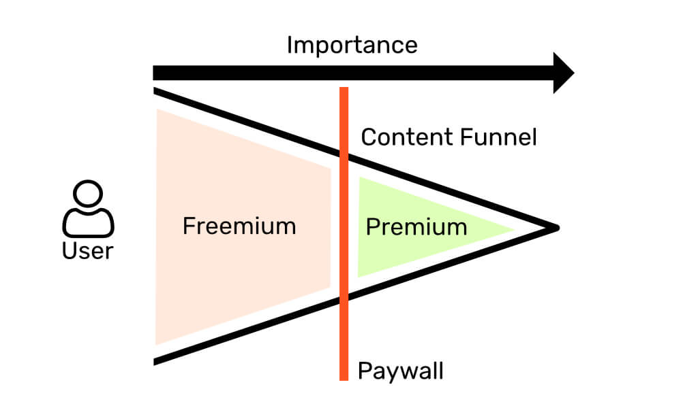
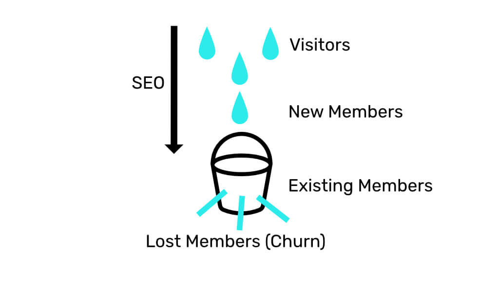

**Factors for growth of your Squarespace <a href="https://www.squarespace.com/ecommerce/membership-sites" target="_blank">membership</a> site** -

## Not everything goes behind the paywall (Freemium Model)
As <a href="https://github.com/trakbit" target="_blank">someone</a> who has built multiple subscription products, I would strongly recommend not to put all your content behind a paywall. Why? Cause users need to know first **is your product worth paying?** The subscription wall should be placed in front of the most important content/business value.

Have the freemium content to market your Squarespace site and the premium content to monetize your site. **Ensure you aren't giving too less or too much** in your freemium part. Giving too less will prevent from bringing users but giving too much will not encourage users to go for the premium. You might not able to know the positioning of paywall in one shot so be willing to readjust it.

## Make the membership worth paying (Value for Money)
For one-time sale you need to give customers one-time business value but for the subscription/membership model you need to **give customers recurring business value**. If there isn't a true need for the customer to revisit your site it's unlikely to lead to a subscription model. So what can one do to make the subscription worthy?
- **Write consistent content -** Don't give out all your content at once. Break it down in chunks and release it with your subscription cycle (weekly, monthly).
- **Give support -** Can be an expensive and time-consuming task so why not bundle it with your subscription service and make it exclusively for your paid users. (eg. - You can use <a href="https://salesjump.xyz/" target="_blank"> **Salesjump**</a> to add Whatsapp chat widget to your pages which are behind the paywall.)

## Not every visitor will become a customer (Conversion rates)
Every user that will visit your Squarespace membership site is not going to pay and that's more than okay. You just need to **focus on building the content funnel** and let the conversion rate filter the customers from the visitors for you.

See the membership model like a leaky bucket, where you as a business owner need to focus on only two factors to keep enough water in the bucket or users in membership -

- Sufficient flow of water/users from the tap by routinely doing <a href="https://salesjump.xyz/blog/squarespace-seo-guide" target="_blank"> **SEO**</a>.
- Reduce the leakage from the bucket/membership by giving high quality content and <a href="https://salesjump.xyz/" target="_blank"> **listening frequently**</a> to your users need.

## Membership model is worth trying (Iterate and Test)
There is no denying that the membership model is hard to monetize but would strongly recommend to trying opting for it. Why? It gives you a steady stream of income thus creating an asset on which you can rely on. Do not expect to have it all perfectly tuned for customer's need, you're very likely to need to readjust it to eventually make it suitable for a much larger audience.