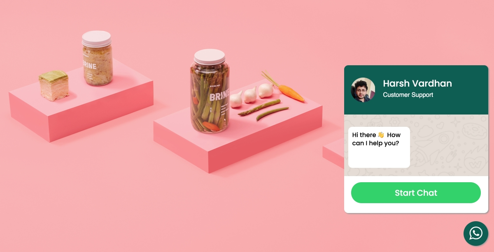
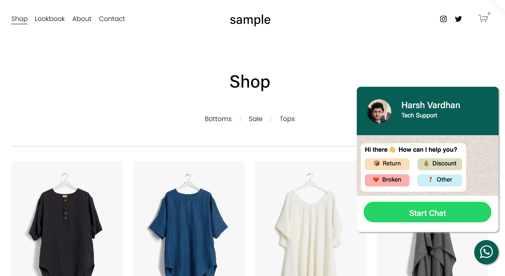
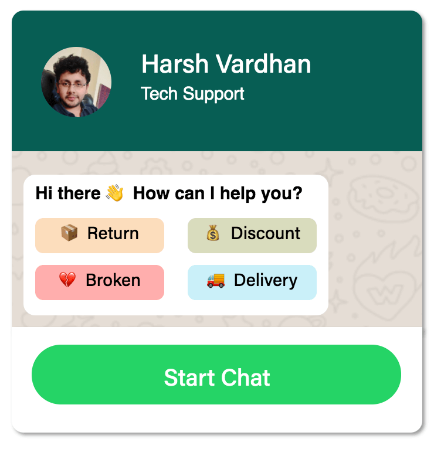

## Problem: Customer support via live chat can be time consuming
Customer support despite being important has it's own set of  <a href="https://salesjump.xyz/blog/live-chat-phone-support" target="_blank"> **challenges**</a> so it was time to rethink how can I make WhatsApp Chat Widget more effective for the squarespace store owners and their customers. 

Currently it's just a simple popup where with a customisable greeting message. So what's exactly missing with that? there's no refinement of customer's query. Every issue regardless of what it's about in same way thus not giving any initial context. So if store owner sees complaints from different customers with no context at the same time 

- it's very hard to know which one to prioritise.
- very hard to cartegorise complaints before having a chat with the customer.

## Solution: Make customer specify the type of their complaint

A simple option selector as above can allow squarespace store owners to raise issues with some context. The moment customer clicks on one of these choices a whatsapp message is created specifying the type and asking for help.

Such situations are also helpful when particular operation of business is down, let's say - **🚚 delivery**. Store owners can ignore messages about **🚚 delivery** since they know delivery process is broken. Such simple screening process of issues can save time of support staff.

If interested email me at <harsh.vardhan.611@gmail.com> 🙂
