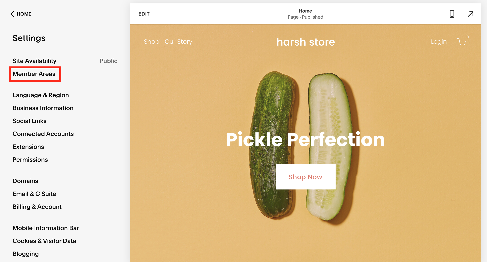
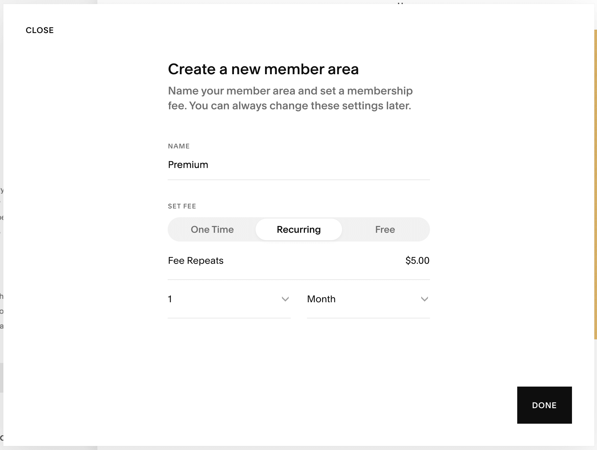
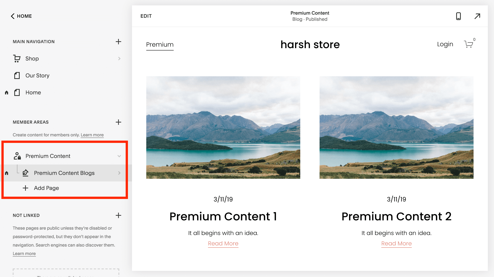
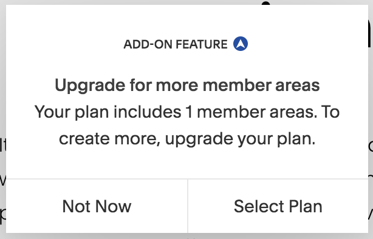

`youtube:https://www.youtube.com/embed/bh9RA8c6iMc`

## 1. Click on Settings ➡️ Member Areas ➡️ Create Member Area.

## 2. Create Squarespace Member Area.

## 3. Configure member area.

## 4. Drop Content in the Membership section you just created.
Now all the content in this section will be member exclusive

## Your membership is now ready in just 4 steps 🙂 -

## The Good
Despite the ease of use you still get to control
- How much to charge
- How often to charge
- What goes behind the paywall and what doesn't

## The Bad

Squarespace <a href="https://www.squarespace.com/ecommerce/membership-sites" target="_blank">Member Areas</a> is seamless solution to create membership sites. But I felt the pricing is a bit too expensive cause if you need 

- multiple pricing tier 
- give option to pay monthly or anually for the same tier

you need to upgrade your plan from $10 to $20 🙁.

## <a href="https://salesjump.xyz/blog/squarespace-membership-subscription" target="_blank">Wanna learn how to grow your squarespace membership site?</a>